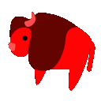

# Yaksplained – All the SerenityOS Yaks, explained!

This heavily relates to [SerenityOS](http://www.serenityos.org).

## On Yakshaving and Serenity's Love of Yaks

Yakshaving refers to doing work that seems pointless but is necessary to achieve a goal later down the line. In the SerenityOS developer community on [Discord](https://discord.gg/serenity), yakshaving is pretty prevalent (after all, building a new operating system requires a bunch of seemingly pointless gruntwork). Yak kind of became synonymous with just "the thing that I'm working on" or "the Serenity-intenal project I have". Therefore, the entire yak thing got out of hand and quite quickly, the Unicode bison emoji (the closest thing to a yak) wasn't enough anymore. So people created more yak emojis. And more yak emojis. And more yak emojis...

## All the Yaks Explained

Note that most of this is based on my personal observations, and while I can remember about half of these being created, I'll most certainly be wrong in how they are used in one place or another. Order is alphabetical.

### Hairyak: How did this grow so fast?

This one's a hairy yak to shave. Used for particularly difficult/cumbersome/long-winded problems.

Created by sin-ack on August 24th, 2021. Reason: Andreas requested a "particularly hairy yak" [(first message in the chain)](https://discord.com/channels/830522505605283862/830525235803586570/879746499108556881).

### Imminentyakshave: This yak's about to be shaved.

Shave incoming. Used for when you're about to solve/currently solving a problem. Or if you noticed a problem and want to solve it right now.

Created by sin-ack on July 17th, 2021. Reason: [requested by Andreas](https://discord.com/channels/830522505605283862/830525235803586570/865881764111450112). Also relevant: [the associated meme](https://discord.com/channels/830522505605283862/830525235803586570/867538791962378240).

### Neoyak: Hax0r

Hacker terminal or coding-themed yak, for all your hacker needs. Used in conjunction with Terminal or pop culture hacker-related things. Also used as a ninja yak when something ninja-related comes up.

Created by sin-ack on June 6th, 2021. Reason: symbols for the bot's LibJS test262 runner status. Here, it is used for all the tests that caused a runner exception. Starting with [this message](https://discord.com/channels/830522505605283862/830525235803586570/851168937131638784), and with encouragement by networkException a conversation commenced that led to the creation of custom emojis for all the test runner results. _These emojis will be referred to here as the neoyak group._

### Skeleyak: That's an old one.

When one of your yaks is really old or just has been sitting around for a long time.

Created by sin-ack on June 6th, 2021. Reason: symbols for the bot's LibJS test262 runner status, part of the _neoyak_ group. Here, it is used for all the tests that timed out. See [this message](https://discord.com/channels/830522505605283862/830525235803586570/851176393000747089).

### Sleepyak: Zzzzz...

Don't wake the yak. A general sleep emoji.

Created by sin-ack on July 30th, 2021. Reason: unknown. [First version's message](https://discord.com/channels/830522505605283862/830525235803586570/870589889320742932).

### Yakbait: Nerd Snipe.

A yak just baiting you to be shaved. Serenity's version of the [nerd snipe](https://xkcd.com/356/).

Created by Andreas on August 7th, 2021. Reason: Andrew commented ["don't yak bait me I'm trying to work on the build system lol"](https://discord.com/channels/830522505605283862/831544568767578162/873671201262817290) (private channel). The similarity to the nerd snipe was first mentioned by networkException a couple of days later [(this message)](https://discord.com/channels/830522505605283862/859531354219872266/875851312686825564).

### Yakbrain: 5Head

That's smart. Comparable use to the 5Head emoji.

Created by Andreas on August 14th, 2021. Reason: unknown.

### Yakchain: \*stampede approaching\*

There's a yak, that leads to another yak, that leads to another yak, ... and so on.

Creation unknown.

### Yakfire: \*smiles\* This is fine!

Something just blew up/went wrong, or you found a fun bug. Can also be used as a "This is fine!" analog.

Created by Andreas on July 1st, 2021. Reason: Brian requested a ["Yak/Buggie wrapped in a warm blanket sipping Earl Grey in front of a fire emoji"](https://discord.com/channels/830522505605283862/851522357734408232/860261769577234452) and Andreas made yakfire instead because it wouldn't be as complicated. "Interpretation left to the viewer".

### Yakfused: Yak is confusion.

Generic confusion emoji.

Created by sin-ack on June 8th, 2021. Reason: In response to an admittedly [weird comment by Ali](https://discord.com/channels/830522505605283862/851522357734408232/851871356051521546), sin-ack used the non-existing catdogconfused, to which Andreas responded with the then-non-existing yakfused. This was promptly created by sin-ack.

### Yakketysax: \*jazz noises\*

A musical yak. "For when you're chasing a yak around all day and getting nowhere."

Created by Sam Atkins on August 18th, 2021. Reason: [the aforementioned purpose](https://discord.com/channels/830522505605283862/831144706079195176/877495085191794699).

### Yakkiss: /ʘ/

Delicious, approved by yak. Used as a replacement for the chef kiss emoji (which also exists on the server), in particular when relating to yaks.

Creation unknown.

### Yakminus: `yakstack.pop()`

You just managed to finish work on something. One yak is off the stack!

Created by sin-ack on June 27th, 2021. Reason: unknown [(this message)](https://discord.com/channels/830522505605283862/830525235803586570/858635750970359808). They first mentioned the idea on June 14th [here](https://discord.com/channels/830522505605283862/830525235803586570/854076622365655060).

### Yakoverflow: The programmer's favorite website.

A pun on Stack Overflow, obviously. When the yak stack gets too large.

Created by Andreas on June 17th, 2021. Reason: Brian requested ["We need agni to make a yakoverflow icon, like the stack overflow logo :^)"](https://discord.com/channels/830522505605283862/831544568767578162/855121465112395806) (private channel).

### Yakplus: `yakstack.push(new Yak())`

You found a problem you want to work on. There's a new yak for your stack!

Created by Andreas on June 14th, 2021. Reason: in response to Lubrsi saying ["aaaaaaaaand our parser is too non-spec-compliant for that workaround"](https://discord.com/channels/830522505605283862/851522357734408232/853953089873510451).

### Yakrage: AAAAAAAAAAAAAAAAAAAAAAAAAAAAAAAAAA

Yak angry. General angry emoji.

Creation unknown.

### Yakshed: ~~who tf even came up with this~~

A combination of yak shaving and bikeshedding. The latter refers to [procrastination or investing time into unimportant issues](https://en.wiktionary.org/wiki/bikeshedding) (as opposed to yakshaving, where time is invested into only _seemingly_ unimportant issues). The emoji can be used when the distinction is not exactly clear.

Created by Andreas on July 18th, 2021. Reason: unknown.

### Yakshrug: idk man

Serenity's shrug emoji. People have mentioned that it looks kind of creepy.

Created by sin-ack on July 31st, 2021. Reason: Andreas responded to [their use of a shrug emoji](https://discord.com/channels/830522505605283862/830739873119207426/870797713439072308) with the then-non-existent yakshrug, which resulted in the creation of the emoji.

### Yakslice: \*surprised yak sounds\*

This yak was just split up. Used when things go wrong in general, or if the yak just got deeper.

Created by sin-ack on June 6th, 2021. Reason: symbols for the bot's LibJS test262 runner status, part of the _neoyak_ group. Here, it is used for all the tests that encounter a harness error. See [this message](https://discord.com/channels/830522505605283862/830525235803586570/851180017261346866).

### Yaksplode: \*even more surprised yak sounds\*

Yak go boom. Similar in use to yakslice, used when things go wrong. Especially for crashes and the likes.

Created by sin-ack on June 6th, 2021: Reason: symbols for the bot's LibJS test262 runner status, part of the _neoyak_ group. Here, it is used for all the tests that encounter a (regular) error. See [this message](https://discord.com/channels/830522505605283862/830525235803586570/851172304959307777).

### Yakstack: But that's already on the stack

Refers to the stuff you want to do in Serenity, your to-do list etc. Used similar to yakoverflow, just in general when referencing all of the many things that are to be done.

Created by Andreas on June 17th, 2021. Reason: unknown. Various people used the term "yakstack" beforehand.

### Yaksteps: I can almost spot the yak in the distance.

There's a yak hiding here. When something seems to lead to a shaveable yak, but you currently only see its traces.

Creation unknown.

### Yaktangle: Well... this got out of control.

A box of hair. Used for the most difficult/cumbersome/long-winded problems.

Created by sin-ack on August 24th, 2021 together with _hairyak_.

### Yakthonk: Hmmmmmmmmmmmmmmmmm

Serenity's thonk emoji, for when something is very strange/interesting.

Created by Andreas on August 19th, 2021. Reason: unknown. The idea was previously mentioned by him on June 8th, 2021 [here](https://discord.com/channels/830522505605283862/830525235803586570/851874120148451350).

### Yaktoberfest: \*bavarian music intensifies\*

Purpose and creation unknown.

## List of people involved

Discord tags in brackets.

* sin-ack (@Agni#5047)
* Sam Atkins (@AtkinsSJ#8644)
* Andreas Kling (@awesomekling#1985)
* Brian Gianforcaro (@bgianf#0001)
* Ali Muhammadpur (@CxByte_#0373)
* Lubrsi (@Lubrsi#5588)
* networkException (@networkException#0001)
* Andrew Kaster (@Rambo#6840)
